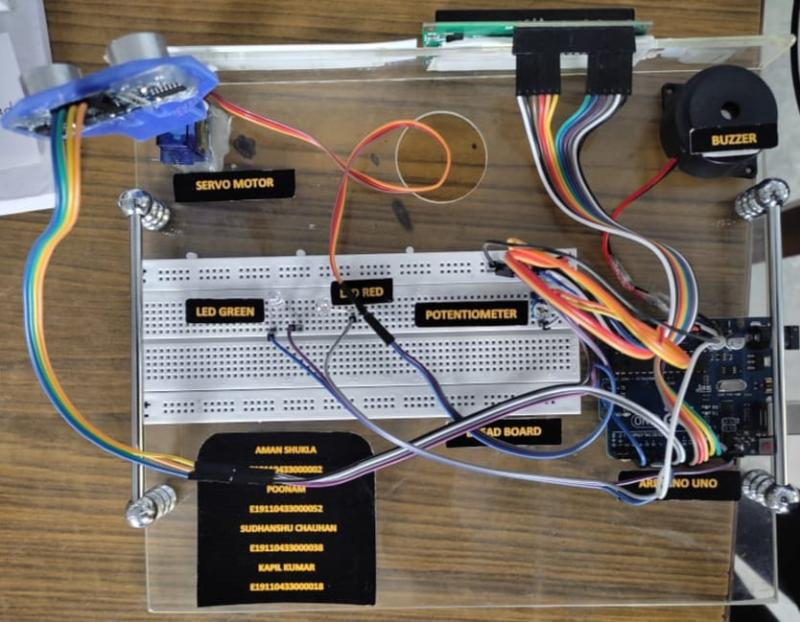
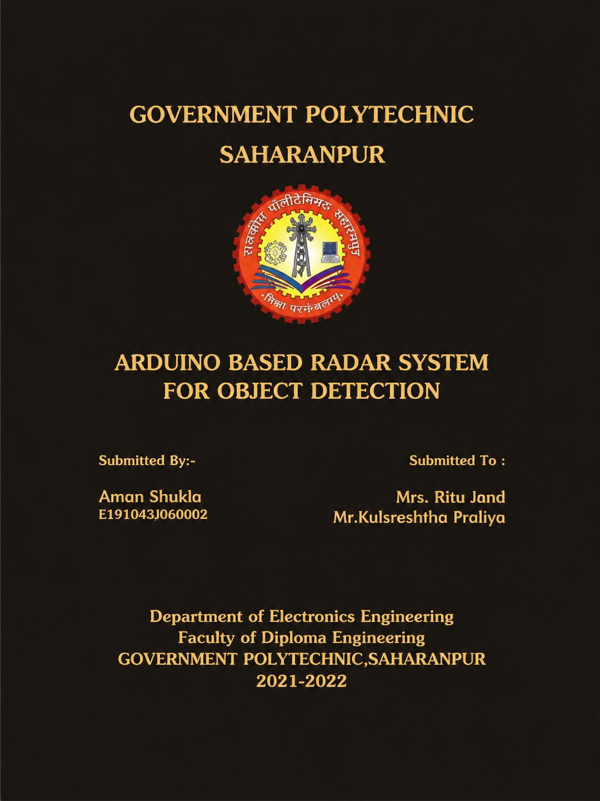
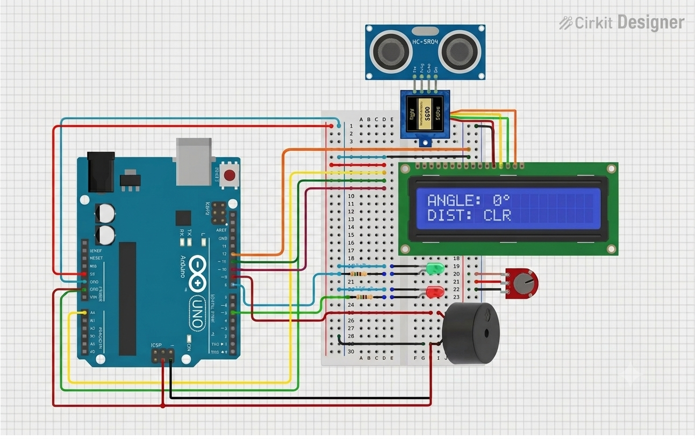
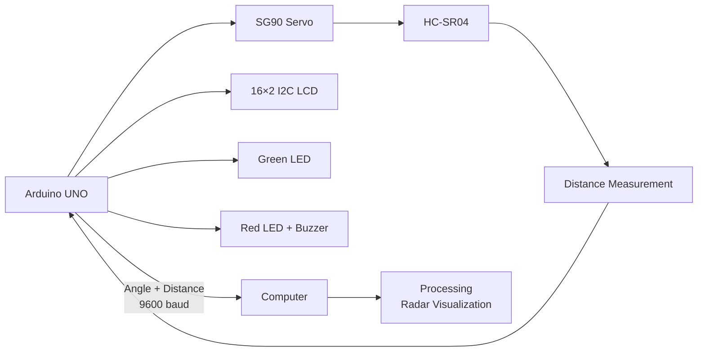

# Arduino Based Radar System for Object Detection

A diploma final-year embedded-systems project developed using **Arduino UNO, HC-SR04 ultrasonic sensor, and SG90 servo motor** to detect objects across a 0°–180° scanning range and visualize their position through a computer-based radar interface.

## Project Achievement

🏆 **2nd Rank — Technical Project Exhibition**

This project was selected and presented at a **Technical Project Exhibition** during my Diploma final year, where it **secured 2nd rank** and received a **trophy and medal** in recognition of the project work.

**Author:** Aman Shukla  
**Project Level:** Diploma Final Year  
**Project Type:** Embedded Systems / Arduino / Object Detection

## Project Overview

The system works as a small-scale radar prototype. An **HC-SR04 ultrasonic sensor** is mounted on an **SG90 servo motor** and rotated through a **0°–180°** scanning range. At each angular position, the sensor measures the distance to an object.

The Arduino UNO processes the angle and distance data and:

- Displays the current angle and object status on a **16×2 I2C LCD**
- Uses a **green LED** for a clear condition
- Uses a **red LED and buzzer** when an object is detected within the warning threshold
- Sends angle and distance data to a computer through **serial communication**
- Uses **Processing** to display the data as a radar-style visualization

### Key Specifications

| Parameter | Value |
|---|---|
| Scan Range | **0°–180°** |
| Scan Step | **2°** |
| Object Warning Threshold | **20 cm** |
| Serial Baud Rate | **9600 baud** |
| Distance Sensor | **HC-SR04** |
| Servo Motor | **SG90** |
| Controller | **Arduino UNO** |
| Computer Visualization | **Processing** |

## Hardware Used

| Component | Purpose |
|---|---|
| **Arduino UNO** | Main controller |
| **HC-SR04 Ultrasonic Sensor** | Object distance measurement |
| **SG90 Servo Motor** | Rotates the ultrasonic sensor |
| **16×2 I2C LCD** | Displays angle, distance, and status |
| **Potentiometer** | LCD contrast adjustment |
| **Green LED** | Clear/no-warning indication |
| **Red LED** | Object warning indication |
| **Buzzer** | Audible object warning |
| **Jumper Wires (M-M, M-F, F-F)** | Circuit connections |

## Project Demonstration



The physical prototype demonstrates the Arduino-based sensing system, servo-mounted ultrasonic sensor, LCD display, and local warning indicators.

## Project Documentation



The project documentation contains the project presentation and supporting material from the diploma final-year project work.

## Circuit Diagram



The circuit connects the Arduino UNO with the HC-SR04 ultrasonic sensor, SG90 servo, 16×2 I2C LCD, LEDs, buzzer, and supporting components.

## Pin Mapping

| Arduino Pin | Component | Function |
|---|---|---|
| **D8** | Buzzer | Warning output |
| **D9** | HC-SR04 TRIG | Ultrasonic trigger |
| **D10** | HC-SR04 ECHO | Ultrasonic echo input |
| **D11** | SG90 Servo | Servo control signal |
| **D12** | Green LED | Clear indication |
| **D13** | Red LED | Warning indication |
| **A4** | 16×2 I2C LCD | SDA |
| **A5** | 16×2 I2C LCD | SCL |

The LCD is configured at I2C address **0x27**.

> The potentiometer is used for physical LCD contrast adjustment and is not controlled by the Arduino firmware.

## Software and Technologies

### Arduino Firmware

- **C/C++**
- **Arduino IDE**
- **Arduino UNO**
- **Servo library**
- **Wire library**
- **LiquidCrystal_I2C library**

### Computer Visualization

- **Processing**
- **Java / Processing Java Mode**
- **Serial Communication**

## System Architecture



## How It Works

1. The **Arduino UNO** commands the SG90 servo to move through the 0°–180° scan range.
2. The **HC-SR04** measures the distance to an object at each servo position.
3. The Arduino associates the measured distance with the current servo angle.
4. The current angle, distance, and status are displayed on the **16×2 I2C LCD**.
5. If an object is detected within **20 cm**, the red LED and buzzer provide a warning.
6. The Arduino transmits the angle and distance through serial communication at **9600 baud**.
7. The **Processing** application receives the data and displays the radar sweep and detected object position.

## Source Code

### Arduino

`code/radar_system.ino`

Contains the Arduino firmware for:

- Servo control
- HC-SR04 distance measurement
- LCD display
- LED indication
- Buzzer warning
- Serial data transmission

### Processing

`code/radar_visualization.pde`

Contains the Processing visualization for:

- Receiving serial angle and distance data
- Rendering the radar sweep
- Displaying detected object position

## Running the Project

1. Connect the hardware according to the pin mapping and circuit diagram.
2. Open `code/radar_system.ino` in **Arduino IDE**.
3. Upload the firmware to the Arduino UNO.
4. Open the Serial Monitor and verify communication at **9600 baud**.
5. Open `code/radar_visualization.pde` in **Processing**.
6. Select the correct Arduino serial port in the Processing sketch.
7. Run the Processing sketch.
8. Place an object within the sensing area and observe the radar visualization and local indicators.

## Project Structure

```text
Arduino-Based-Radar-System-for-Object-Detection/
├── code/
│   ├── README.md
│   ├── radar_system.ino
│   └── radar_visualization.pde
├── circuit/
│   ├── README.md
│   └── circuitradar_circuit_diagram.png
├── document/
│   ├── README.md
│   └── radar-project-cover.png
├── setup-image/
│   ├── README.md
│   └── 1780160873743.jpg
├── video/
│   └── README.md
└── README.md
```

## Project Status

**Completed — Diploma Final-Year Project**

This project demonstrates practical implementation of:

- Embedded C/C++ programming
- Arduino microcontroller interfacing
- Ultrasonic distance measurement
- Servo motor control
- I2C LCD interfacing
- LED and buzzer control
- Serial communication
- Computer-based visualization using Processing

## Achievement

### 🏆 2nd Rank — Technical Project Exhibition

The project was selected for a **Technical Project Exhibition** during my Diploma final year and **secured 2nd rank**, for which I received a **trophy and medal**.

This project was an important part of my early hands-on experience in embedded systems, sensor interfacing, and hardware-software integration.

## Author

**Aman Shukla**  
Diploma in Electronics Engineering  
Government Polytechnic, Saharanpur
