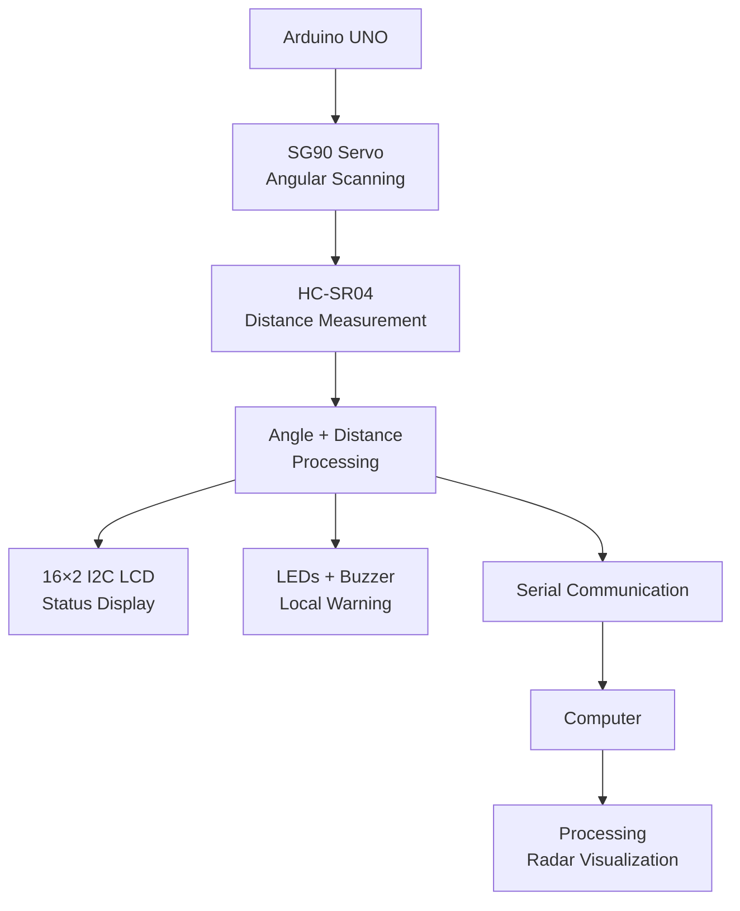

# Arduino Based Radar System for Object Detection

An Arduino-based radar prototype that scans a defined angular range using an **HC-SR04 ultrasonic sensor mounted on an SG90 micro servo**. The measured angle and distance are sent over serial communication to a **Processing** visualization, while a **16×2 I2C LCD, LEDs, and buzzer** provide local status indication.

## Project Overview

The system performs a full **0° to 180° sweep** and then returns from **180° to 0°**. At each servo position, the HC-SR04 measures the distance to an object. The Processing visualization represents the complete 0°–180° scanning range.

- Scan range: **0°–180°**
- Scan step: **2°**
- Warning threshold: **20 cm**
- Serial communication: **9600 baud**
- Serial data format: `angle,distance.`
- Processing displays the radar sweep and detected object position.
- Red LED and buzzer indicate an object within the warning distance.
- Green LED indicates a clear condition.
- 16×2 I2C LCD displays the current angle and status.
- A potentiometer is used for LCD contrast adjustment in the hardware setup.

## Hardware Used

| Component | Purpose |
|---|---|
| **Arduino UNO** | Main controller for sensor acquisition, servo control, indicators, LCD, and serial communication |
| **HC-SR04 Ultrasonic Sensor** | Measures the distance to objects using ultrasonic time-of-flight |
| **SG90 Micro Servo Motor** | Rotates the ultrasonic sensor through the scan angle |
| **16×2 I2C LCD** | Displays scan angle, object distance, and clear/warning status |
| **Potentiometer** | Used for LCD contrast adjustment in the hardware setup |
| **Green LED** | Indicates clear/no-warning condition |
| **Red LED** | Indicates an object within the warning threshold |
| **Buzzer** | Provides audible warning when an object is detected within the threshold |
| **Jumper Wires (M-M, M-F, F-F)** | Used for temporary prototype interconnections |

The Arduino UNO is based on the ATmega328P and provides digital I/O, analog inputs, PWM capability, USB connectivity, and I2C pins used by this type of prototype. [Arduino UNO R3 documentation](https://docs.arduino.cc/hardware/uno-rev3) provides the official board specifications and pin information.

## Pin Mapping

| Arduino Pin | Component | Function |
|---|---|---|
| D8 | Buzzer | Warning output |
| D9 | HC-SR04 TRIG | Ultrasonic trigger |
| D10 | HC-SR04 ECHO | Ultrasonic echo input |
| D11 | SG90 Servo | Servo control signal |
| D12 | Green LED | Clear indication |
| D13 | Red LED | Warning indication |
| A4 | 16×2 I2C LCD | SDA |
| A5 | 16×2 I2C LCD | SCL |

The current firmware initializes the LCD at I2C address **0x27**.

> **Note:** The potentiometer is part of the physical LCD setup for contrast adjustment and is not controlled by the Arduino firmware.

## Software and Technologies

### Programming Technologies

- **C/C++ — Arduino firmware:** The `radar_system.ino` sketch uses Arduino-style C/C++ code with the `Wire`, `LiquidCrystal_I2C`, and `Servo` libraries.
- **Java — Processing visualization:** The `radar_visualization.pde` sketch uses Processing's Java mode for the computer-side radar display. Java mode is the default programming mode in Processing. [Processing Environment documentation](https://processing.org/environment/)

### Development and Visualization Tools

- **Arduino IDE** — Used to write, compile, and upload the Arduino firmware to the UNO. Arduino's official documentation describes the IDE workflow for selecting a board and uploading sketches. [Arduino IDE documentation](https://docs.arduino.cc/software/ide/)
- **Processing** — Used to receive the Arduino serial data and render the radar visualization. [Processing official documentation](https://processing.org/reference/)
- **Serial communication** — Transfers the current scan angle and measured distance from the Arduino to the Processing application at **9600 baud**.

## Circuit Diagram


The circuit diagram shows the Arduino UNO connections to the HC-SR04 ultrasonic sensor, SG90 servo, 16×2 I2C LCD, LEDs, buzzer, and potentiometer used in the prototype.

## System Architecture

The radar prototype follows a simple embedded sensing and visualization path, with the Arduino UNO coordinating ultrasonic measurement, servo scanning, local indication, and serial communication.



The architecture represents the completed prototype workflow from servo-based ultrasonic scanning to local status indication and computer-side radar visualization.

## How It Works

1. The **SG90 servo** rotates the HC-SR04 through the configured 0°–180° scan range.
2. The **HC-SR04** measures the distance to objects at each scan position.
3. The **Arduino UNO** associates the measured distance with the current servo angle.
4. The **LCD, LEDs, and buzzer** provide local status and warning indication.
5. The measured angle and distance are transmitted over serial communication.
6. **Processing** receives the serial data and renders the radar visualization.

## Code

- `code/radar_system.ino` — Arduino firmware for servo scanning, HC-SR04 distance measurement, LCD output, LED/buzzer alerts, and serial transmission.
- `code/radar_visualization.pde` — Processing sketch for receiving serial data and displaying the radar sweep and detected object.

## Running

1. Connect the hardware according to the pin mapping.
2. Upload `code/radar_system.ino` to the Arduino UNO using Arduino IDE.
3. Verify serial output at **9600 baud**.
4. Open `code/radar_visualization.pde` in Processing.
5. Set the serial port in the Processing sketch to the Arduino's actual port.
6. Run the Processing sketch and place an object within the sensing area.

## Project Structure

```text
Arduino-Based-Radar-System-for-Object-Detection/
├── code/
│   ├── README.md
│   ├── radar_system.ino
│   └── radar_visualization.pde
├── document/
│   └── README.md
├── circuit/
│   └── README.md
├── setup-image/
│   └── README.md
├── video/
│   └── README.md
└── README.md
```

## Scan and Visualization

The SG90 servo is controlled across its full **0°–180° range**, and the Processing interface is configured to visualize the corresponding 0°–180° radar sweep. This gives the prototype a full angular scanning field rather than limiting the scan to a smaller central range.

## Project Status

**Status: Completed Prototype**

The project demonstrates ultrasonic distance measurement, servo-based angular scanning, local object warning, serial data transmission, and computer-side radar visualization.

## References

- [Arduino UNO R3 — Official documentation](https://docs.arduino.cc/hardware/uno-rev3)
- [Arduino IDE — Official documentation](https://docs.arduino.cc/software/ide/)
- [Processing — Official documentation](https://processing.org/environment/)
- [Processing Reference](https://processing.org/reference/)
- [Arduino Project Hub — SG90 Micro Servo example](https://projecthub.arduino.cc/arduino_uno_guy/the-beginners-guide-to-micro-servos-ae2a30)

## Author

**Aman Shukla**  
B.Tech Electronics Engineering | Sensors & Transducers Technology
